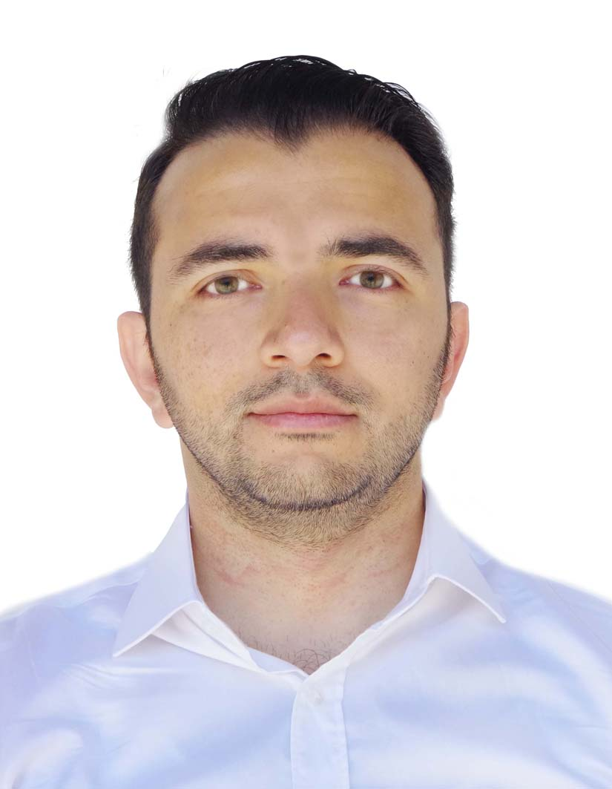

# Kamran's Page      [About Me](https://kamranbadirov.tech/about)

 

Hello, World! My name is Kamran. I am a 4th year CS student at UofT. Currently I am doing 16 month PEY at IBM as a backend developer. I am fascinated about science and technology,
thefore I am a lifelong learner. 

# Contacts

- Add on me on [LinkedIn](https://www.linkedin.com/in/badirov-kamran/).
- Follow me on [Twitter](https://twitter.com/kamranbadirov).
- My [GitHub](https://github.com/kamrandb).
